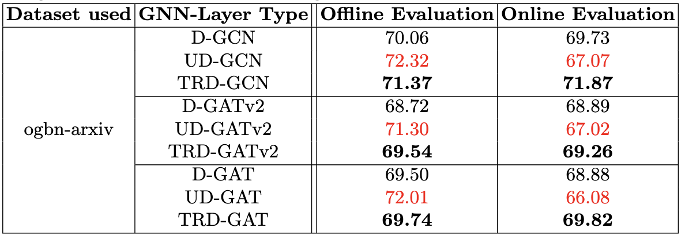

# Boosting the performance of Deployable Timestamped Directed GNNs via Time-Relaxed Sampling

## ECML PKDD 2023 [[`Paper`](https://www.amazon.science/publications/boosting-the-performance-of-deployable-timestamped-directed-gnns-via-time-relaxed-sampling)] 


**Arihant Jain, Gundeep Arora, Anoop Saladi**\
International Machine Learning, Amazon, Bengaluru, India

This is the PyTorch implementation for our approach on ogbn-arxiv dataset. 

## Overview


Figure depicts the computational graphs created by different GNN models (D-GNN, UD-GNN and TRD-GNN) for the given directed graph. It showcases how TRD-GNN acknowledges timestamp ordered-edges by adding new signal from v1 (since t1 $<$ t2) and eliminating signal from v3 (since t2 $<$ t3), leading to improved performance.

### Why use TRD-GNN?
- Resilient to label-leakage
- Make the model reliable to use in production
- Agnostic to GNN layer 
- Extensible to all GNN based tasks where time direction is critical

## Setup the requirements
Run the following commands to setup your environment
```
git clone https://github.com/amazon-science/trd-gnn.git
cd trd-gnn/
pip install -r requirements.txt
```

## Training
```
python trd-gcn.py
```

## Results


Table reports the results in terms of accuracy (in \%) on the homogeneous ogbn-arxiv citation dataset with multiple GNN backbones. TRD-GNN improves over D-GNN by 1-2\% and over UD-GNN by 2-5\% during online evaluation. The performance of TRD-GNN is close to offline evaluation making the approach reliable. The results in red show huge drop in the performance of UD-GNN model in case of online evaluation, making it unfit for production setting.


## Acknowledgement
Our implementation is based on the [DGL OGB Pytorch Examples](https://github.com/dmlc/dgl/tree/master/examples/pytorch/ogb/ogbn-arxiv).

## Citation
If you find our paper or codebase useful, please consider citing us as:
```latex
@Inproceedings{Jain2023,
 author = {Arihant Jain and Gundeep Arora and Anoop S V K K Saladi},
 title = {Boosting the performance of deployable timestamped directed GNNs via time-relaxed sampling},
 year = {2023},
 url = {https://www.amazon.science/publications/boosting-the-performance-of-deployable-timestamped-directed-gnns-via-time-relaxed-sampling},
 booktitle = {ECML PKDD 2023},
}
```

## Security

See [CONTRIBUTING](CONTRIBUTING.md#security-issue-notifications) for more information.

## License

This project is licensed under the Apache-2.0 License.