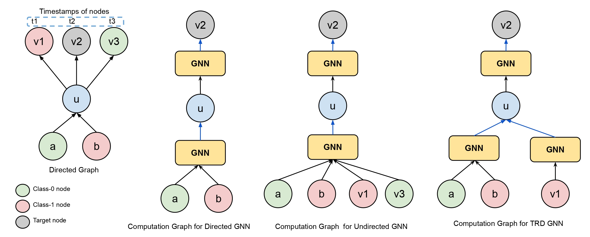

# Boosting the performance of Deployable Timestamped Directed GNNs via Time-Relaxed Sampling

## ECML PKDD 2023

Arihant Jain, Gundeep Arora, Anoop Saladi\
International Machine Learning, Amazon, Bengaluru, India


Figure depicts the computational graphs created by different GNN models (D-GNN, UD-GNN and TRD-GNN) for the given directed graph. It showcases how TRD-GNN acknowledges timestamp ordered-edges by adding new signal from v1 (since t1 $<$ t2) and eliminating signal from v3 (since t2 $<$ t3), leading to improved performance.

## Setup the requirements
Run the following commands to setup your environment
```
git clone https://github.com/amazon-science/trd-gnn.git
cd trd-gnn/
pip install -r requirements.txt
```

## Training
```
python python trd-gcn.py
```

## Security

See [CONTRIBUTING](CONTRIBUTING.md#security-issue-notifications) for more information.

## License

This project is licensed under the Apache-2.0 License.